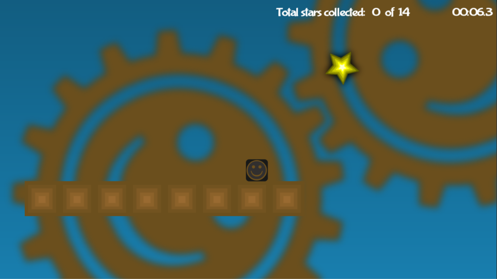
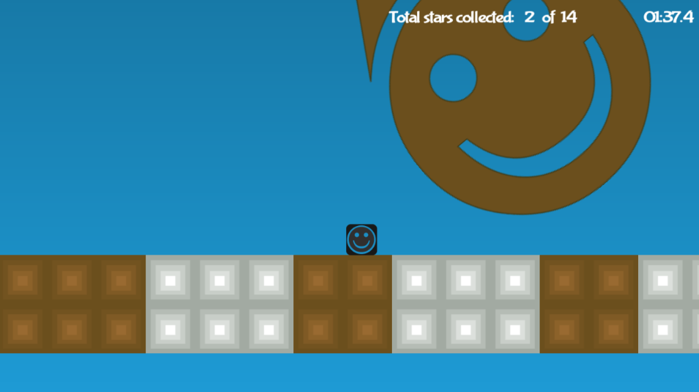
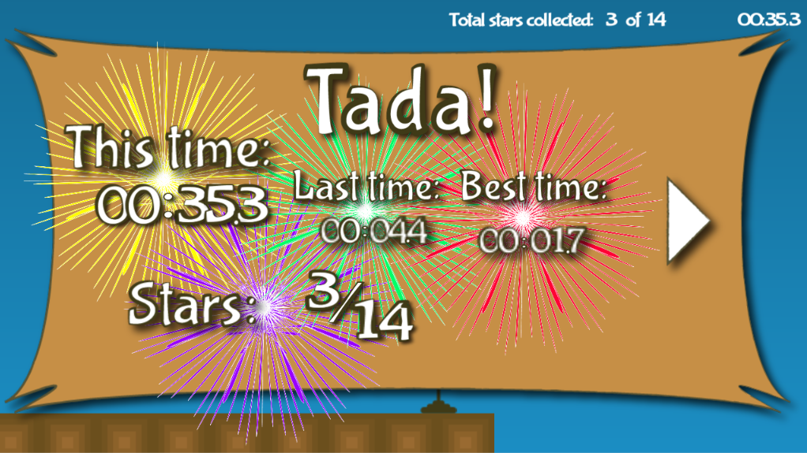

# :video_game: Safe Between the Cogs

Safe Between the Cogs is a 2D video game developed in Unity3D 5.6.  There is currently only a single level but more to come.  ALL graphics and code were developed by me.  If you would like to collabrate in anyway, let me know.

Working example can be found on [facebook](https://apps.facebook.com/1893696650851210).

### Things still left to do:

* Create leaderboard
* Create more levels
* Need a better looking UI
* Need to use better audio clips
* Facebook sharing

### Gameplay

### License

Copyright (C) 2017  Andrew Schools

This program is free software: you can redistribute it and/or modify
it under the terms of the GNU General Public License as published by
the Free Software Foundation, either version 3 of the License, or
(at your option) any later version.

This program is distributed in the hope that it will be useful,
but WITHOUT ANY WARRANTY; without even the implied warranty of
MERCHANTABILITY or FITNESS FOR A PARTICULAR PURPOSE.  See the
GNU General Public License for more details.

You should have received a copy of the GNU General Public License
along with this program.  If not, see <http://www.gnu.org/licenses/>.
